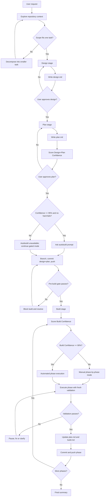

# Otto

Inspired by established agentic design/planning/build workflows.

Otto is a unified workflow with three artifacts in sequence:

1. `design.md`
2. `plan.md`
3. `build.md`

Default output path:

`.agents/tasks/<YYYY-MM-DD>-<feature-short-name>/`

## Logic Flow

## Hard Gates

- Never start Build until Design and Plan are approved.
- Never start Build until branch, commit, and push gates pass.
- Never bypass quality validation for a completed phase.
- Never continue automated build execution when build validation fails or request clarity is missing.

## Workflow

### Stage 1: Design

Before starting Design, read:

- [DESIGN-PROTOCOL.md](references/DESIGN-PROTOCOL.md)
- [DESIGN-TEMPLATE.md](references/DESIGN-TEMPLATE.md)

1. Explore codebase context (files, docs, recent commits, conventions).
2. Assess whether the request must be decomposed before design.
3. Ask one clarifying question at a time.
4. Propose 2-3 approaches with tradeoffs and a recommendation.
5. Present design sections incrementally and collect approval.
6. Write `design.md` at the run path.
7. Run a self-review pass (ambiguity, contradictions, placeholders, scope).
8. Ask user to approve final `design.md`.

Design output must include:

- Goal
- Success criteria
- Constraints
- Scope / non-goals
- Chosen approach and alternatives considered
- Architecture and component boundaries
- Data flow
- Error handling
- Test strategy
- Risks and mitigations
- Planning inputs

### Stage 2: Plan

Before starting Plan, read:

- [PLANNING-PROTOCOL.md](references/PLANNING-PROTOCOL.md)
- [PLAN-TEMPLATE.md](references/PLAN-TEMPLATE.md)
- [CONFIDENCE-RUBRIC.md](references/CONFIDENCE-RUBRIC.md)

1. Use approved `design.md` as source of truth.
2. Detect stack, quality tools, and validation commands from repo docs first.
3. Fill only plan-blocking gaps with targeted questions.
4. Research current practices when local docs and code patterns are insufficient.
5. Explore codebase patterns, integration points, and local technical debt.
6. Assess whether bootstrap or refactor phases are required.
7. Define architecture, data flow, contracts, and error handling.
8. Produce phase-based plan with dependencies, estimates, and Definition of Done.
9. Detail code deltas and test-first task structure.
10. Score Design+Plan Confidence.
11. Write `plan.md`, self-review it, and ask user for approval.

Plan requirements:

- Phase list with estimates and dependencies
- Architecture and implementation decisions
- Research findings when external or version-sensitive guidance was needed
- Integration points and affected files
- Bootstrap/refactor phases when required
- Task checklist per phase
- Test-first steps per task
- Validation commands per phase
- Phase status fields that can be updated during Build
- Checkpoint notes for context management

Planning protocol details live in [PLANNING-PROTOCOL.md](references/PLANNING-PROTOCOL.md).

## Confidence Model

Otto tracks two confidence scores.

### A) Design+Plan Confidence

Purpose: governs whether Autobuild mode can be offered.

- Combined method: hard-fails + rubric scoring.
- Compute at:
  - end of Design
  - end of Plan
- If hard-fail exists, confidence cannot reach 95%.

Threshold behavior:

- If `>=95%` and no hard-fails, ask exactly:
  - `Confidence is X%. Do you want to run in autobuild mode?`
- If `<95%`, state explicitly that Autobuild is unavailable below threshold.

Rubric details live in [CONFIDENCE-RUBRIC.md](references/CONFIDENCE-RUBRIC.md).

### B) Build Confidence

Purpose: hard gate for build execution readiness.

- Compute immediately before build kickoff and before each phase.
- If `<90%`: do not run automated build execution. Fall back to manual phase-by-phase mode.
- If `>=90%`: automated phase execution is allowed.

## Branch / Commit / Push Gate (Required Before Build)

After user approves `plan.md`, Otto must automatically:

1. Verify GitHub CLI access with `gh auth status` when the repository is hosted on GitHub.
2. Inspect repository identity with `gh repo view --json nameWithOwner,url` when available.
3. Create or switch to branch `<feature-short-name>`.
4. Ensure `design.md` and `plan.md` exist in run directory.
5. Commit those files with:
   - `chore: add initial design.md and plan.md files for feature "<feature-short-name>"`
6. Push the branch to remote and set upstream.
7. Confirm remote branch visibility with `gh repo view` or `git ls-remote --heads origin <feature-short-name>`.

Use git CLI for local branch, commit, and push operations. Use `gh` for GitHub repository lookup, authentication checks, PR/issue lookup, and remote confirmation.

If any of these fail, Build is blocked until resolved.

## Stage 3: Build

Build executes the approved `plan.md` and writes evidence to `build.md`.

Before starting Build, read:

- [BUILD-PROTOCOL.md](references/BUILD-PROTOCOL.md)
- [BUILD-LOG-TEMPLATE.md](references/BUILD-LOG-TEMPLATE.md)
- [CONFIDENCE-RUBRIC.md](references/CONFIDENCE-RUBRIC.md)

### Execution Policy

- Preferred mode: automated phase execution.
- Run sequentially by default.
- For clearly independent tasks/phases, require parallel execution.
- Pause only when:
  - validation fails
  - ambiguity blocks safe execution
  - user clarification is required
  - repository, branch, or dependency state is unsafe

### Per-Phase Protocol

For each phase:

1. Read phase scope, dependencies, tasks, Definition of Done, and validation commands.
2. Run critical plan review for the phase.
3. Confirm Build Confidence `>=90%`.
4. Mark the phase in progress in `plan.md`.
5. Execute task checklist in dependency order.
6. Enforce test-first order for every code-changing task.
7. Run fresh validation evidence for tests, lint, format, and type/build checks.
8. Update `plan.md` after validation passes.
9. Append phase outcome and evidence to `build.md`.
10. Commit phase changes with a conventional commit message.
11. Push the branch and confirm remote visibility.
12. Continue automatically only if validation passed and Build Confidence remains `>=90%`.

Before running validation, read [scripts/README.md](scripts/README.md) if the stack is unclear or the default validator does not match the repository.

### Build Log Must Capture

- Timestamped phase summary
- Build mode and Build Confidence score
- Commands executed for verification
- Validation pass/fail results
- Files changed
- Commit message(s)
- Push result
- Open issues / follow-up actions

## Script Resources

- `scripts/validate-phase.sh`: validates linter, formatter, type checks, and tests for common stacks.
- `scripts/README.md`: script usage and expected behavior.

## Safety Rules

- No destructive git operations unless explicitly requested by user.
- No skipped validations for “small” changes.
- No build continuation after failed validation without remediation.
- No hidden assumptions: surface blockers immediately.

## Completion

The workflow is complete when:

1. All planned phases are done.
2. Validation passes for each completed phase.
3. `build.md` is complete and current.
4. User receives a concise summary of results, risks, and next steps.
